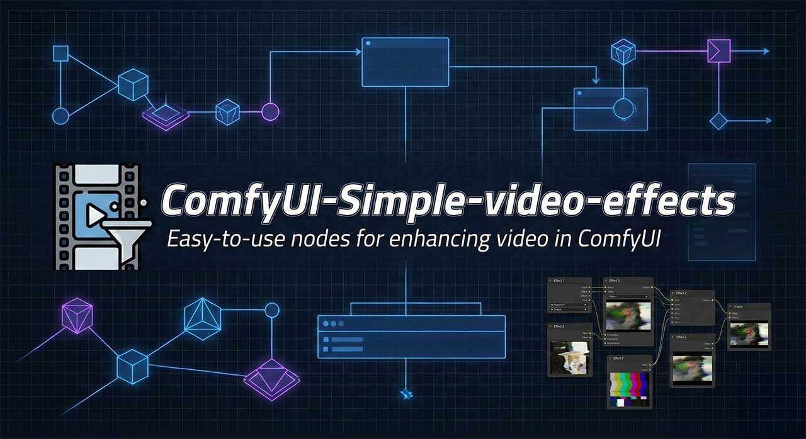

# 🎞️ **ComfyUI Simple Video Effects**

A collection of lightweight, production-ready **video manipulation nodes for ComfyUI**.
All nodes operate on **batched IMAGE tensors (B, H, W, C)** and are designed for smooth, high-quality transformations without breaking aspect ratio.

This bundle includes:

<details>
<summary>1. Zoom Sequence ➜ per-batch zoom in/out with easing</summary>

Single-batch smooth zoom-in/out with aspect-correct cropping
Source: *comfy_zoom_sequence.py*  

### **What it does**

Creates a smooth zoom-in or zoom-out animation across a batch of frames
while **maintaining the original canvas size and aspect ratio**.

### **Key Features**

* Zoom **in** or **out** across the batch
* **Progressive zoom per frame**
* Choose from: Linear, Ease-In, Ease-Out, Ease-In-Out
* Automatic **aspect-correct cropping**
* Prevents over-zooming using safe margin clamp

### **Inputs**

| Name               | Type                                      | Description                                   |
| ------------------ | ----------------------------------------- | --------------------------------------------- |
| `images`           | IMAGE                                     | Batched frames                                |
| `mode`             | Zoom In / Zoom Out                        |                                               |
| `pixels_per_frame` | FLOAT                                     | Zoom speed, based on smaller canvas dimension |
| `ease`             | Linear / Ease_In / Ease_Out / Ease_In_Out |                                               |

### **Outputs**

* `images` – transformed frames
* `info` – diagnostics, safe-limit notes, applied margins

### **How it works**

The node computes a per-frame eased progress value, converts it into a
**small-dimension margin**, and crops proportionally on both axes to retain aspect ratio
before resizing back to original resolution.
All cropping is done with **integer-accurate** bounds.
</details>

<details>
<summary>2. Batched Zoom Sequence – persistent zoom across multiple batches</summary>

Persistent zoom across multiple batches
Source: *comfy_zoom_sequence_batched.py*  

### **What it does**

Extends ZoomSequence to support **streamed / chunked video processing**.
Zoom state is stored in a temporary JSON file and automatically resumes between node calls.

### **Key Features**

* Continues zoom from previous batch
* Automatically clears state when end-of-video is reached
* Fully aspect-correct
* Same easing options and zoom behavior as single-batch version

### **Inputs**

| Name                 | Type        | Description                           |
| -------------------- | ----------- | ------------------------------------- |
| `images`             | IMAGE       | Batch of frames                       |
| `source_frame_count` | INT         | Total number of frames in whole video |
| `mode`               | Zoom In/Out |                                       |
| `pixels_per_frame`   | FLOAT       | Zoom speed                            |
| `ease`               | Easing mode |                                       |

### **How it works**

The node tracks:

* Last processed global frame index
* Max zoom margin
* Canvas dimensions
* Easing + mode consistency

State resets when the node reaches frame `source_frame_count - 1`.
</details>

<details>
<summary>3. Camera Move – pan/slide across the frame</summary>

Smooth pan / slide / 2D translation
Source: *comfy_camera_move.py*

### **What it does**

Moves the camera viewport across the frame in X/Y over the batch, creating a
pan or tracking-shot effect.

### **Typical Controls**

* `move_x_start`, `move_x_end`
* `move_y_start`, `move_y_end`
* `ease`
* `clamp_edges`
* `pixels_per_frame` or percentage-based movement

### **Output**

* Frames translated with border fill (usually black or edge-clamped)
* Handy for synthetic dolly, parallax, or motion-graphics effects

</details>

<details>
<summary>4. Camera Shake – procedural handheld/chaotic motion</summary>

Procedural handheld shake
Source: *comfy_camera_shake.py*

### **What it does**

Adds natural-feeling camera shake using circular or random motion patterns.

### **Features**

* Circular or random shake modes
* Adjustable shake radius
* Easing control for shake envelope
* Loop toggle for seamless looping
* Aspect-correct cropping prevents black edges

Great for action shots, handheld look, or simulating vibrations.

</details>

<details>
<summary>5. Video Overlay – alpha-blend / composite one video over another</summary>

Composite one video onto another
Source: *comfy_video_overlay.py*

### **What it does**

Alpha-blends a foreground video onto a background video.

### **Features**

* Supports per-pixel alpha channel
* Automatic batch alignment
* Position + scale controls
* Optional auto-fit

</details>

<details>
<summary>6. Image Transition – create transition videos between two images</summary>

Create smooth transition videos between two images
Source: *comfy_image_transition.py*

### **What it does**

Generates an MP4 video that transitions from one image to another using a mask-based reveal effect, with optional line visualization.

### **Key Features**

* Horizontal or vertical reveal direction
* Adjustable duration in seconds
* Optional visible line at the reveal edge with customizable thickness and color
* Automatic filename generation with prefix + "_001.mp4"
* Saves to ComfyUI's default output directory

### **Inputs**

| Name         | Type          | Description                          |
| ------------ | ------------- | ------------------------------------ |
| `image1`     | IMAGE         | Bottom layer image                   |
| `image2`     | IMAGE         | Top layer image (revealed)           |
| `duration`   | FLOAT         | Transition duration in seconds       |
| `direction`  | Select        | Reveal direction: Vertical-Down, Vertical-Up, Horizontal-Left, Horizontal-Right |
| `line_toggle`| BOOLEAN       | Enable/disable visible line          |
| `thickness`  | INT           | Line thickness in pixels             |
| `hex_color`  | STRING        | Line color as hex (e.g., #FFFFFF)    |
| `prefix`     | STRING        | Filename prefix                      |

### **Outputs**

* `output_path` – Full path to the generated MP4 file

### **How it works**

The node creates a frame-by-frame animation where image2 is gradually revealed over image1 using a dynamic mask. If enabled, a colored line marks the current reveal position. Frames are encoded into an MP4 video using ffmpeg at 24 FPS.

</details>

<details>
<summary>7. Simple Folder Video Combiner – concatenate multiple video files from a directory</summary>

Simple concatenation of multiple video files from a directory
Source: *comfy_simple_video_combiner.py*

### **What it does**

Takes a directory path and concatenates all video files matching a pattern (e.g., `*.mp4`) into a single output video file. Files are combined in alphabetical order using efficient ffmpeg concatenation.

### **Key Features**

* Simple and fast video concatenation
* Automatic file discovery with glob pattern matching
* Supports GPU-accelerated encoding (NVENC)
* Unique output filename generation to avoid overwrites
* Automatic cleanup of temporary files

### **Inputs**

| Name               | Type    | Description                                      |
| ------------------ | ------- | ------------------------------------------------ |
| `directory_path`   | STRING  | Path to directory containing video files         |
| `output_filename`  | STRING  | Name for output file (default: "combined_output.mp4") |
| `file_pattern`     | STRING  | Glob pattern for matching files (default: "*.mp4") |
| `use_gpu`          | BOOLEAN | Enable GPU encoding (NVENC) (default: True)      |

### **Outputs**

* `output_path` – Full path to the concatenated video file

### **How it works**

1. Scans the specified directory for files matching the pattern
2. Sorts files alphabetically
3. Creates a temporary concat file list for ffmpeg
4. Uses ffmpeg's concat demuxer to join videos efficiently
5. Encodes output with H.264 (optionally with NVENC GPU acceleration)
6. Cleans up temporary files automatically

### **Performance**

* Uses ffmpeg's optimized concat demuxer (no re-encoding of content)
* GPU acceleration available for final output encoding
* Minimal memory usage and fast processing

### **Use Cases**

* Combining multiple video clips from a sequence
* Merging rendered animation frames
* Creating compilation videos from separate segments

</details>

<details>
<summary>8. Advanced Folder Video Combiner – advanced video combining with transitions, fades, and audio</summary>

This script provides a **ComfyUI-compatible node** for automatically combining multiple video files from a directory into a single edited output.
It offers robust handling of transitions, fades, audio overlays, randomization, and resolution normalization—all wrapped in an easy-to-use, configurable ComfyUI node.

> **Inspired by:**
> [DarioFT / ComfyUI-VideoDirCombiner](https://github.com/DarioFT/ComfyUI-VideoDirCombiner)

---

## ✨ Features

### 🔍 Directory Scanning & File Control

* Scans a target directory for video files matching a pattern (e.g., `*.mp4`).
* Supports alphabetical sorting.
* Supports randomized order with optional seed.
* Guarantees no repeated clips.

### 🎬 Video Transitions & Fades

* Optional **crossfade transitions** between clips.
* Optional **fade-in** from a solid color.
* Optional **fade-out** to a solid color.
* All fade colors sanitized to `#RRGGBB`.

### 🔊 Audio Integration (VideoHelperSuite)

* Accepts **VHS/ComfyUI audio format** input.
* Supports both:

  * Direct audio file paths, or
  * Waveform + sample rate tensors (auto-converted to WAV).
* Optional trimming of final video to match audio duration.
* Final fade-out will automatically adjust to audio length if needed.

### ⚙️ Resolution & FPS Normalization

* Detects the first video’s:

  * width
  * height
  * FPS
* Normalizes all clips (and color fades) to match it, ensuring alignment and avoiding FPS-related errors.

### 🚀 Performance

* Uses **parallel duration probing** (ThreadPoolExecutor).
* Uses optimized ffmpeg filter-graphs for transitions.
* Automatic cleanup of temporary files.

### 🧪 Safety & Robustness

* Unique output filenames (avoids overwriting).
* Detailed validation and error messages.
* Proper handling of edge cases like:

  * Clips shorter than transition duration
  * Invalid hex color input
  * Missing or malformed audio dicts

---

## 🛠️ Inputs

### Required Inputs

| Name                  | Type   | Description                       |
| --------------------- | ------ | --------------------------------- |
| `directory_path`      | String | Folder containing video files     |
| `output_filename`     | String | Name of final output file         |
| `file_pattern`        | String | File glob pattern (e.g., `*.mp4`) |
| `transition`          | Select | `none` or `fade` between clips    |
| `transition_duration` | Float  | Fade duration between clips       |

### Optional Inputs

| Name                | Type    | Purpose                        |
| ------------------- | ------- | ------------------------------ |
| `sort_files`        | Boolean | Sort clips alphabetically      |
| `random_order`      | Boolean | Shuffle order (overrides sort) |
| `seed`              | Int     | Seeded randomization           |
| `music_track`       | AUDIO   | VideoHelperSuite audio object  |
| `trim_to_audio`     | Boolean | End video when audio ends      |
| `fade_in_enabled`   | Bool    | Prepend a color fade-in        |
| `fade_in_color`     | String  | Hex color                      |
| `fade_in_duration`  | Float   | Fade-in length                 |
| `fade_out_enabled`  | Bool    | Append/force fade-out          |
| `fade_out_color`    | String  | Hex color                      |
| `fade_out_duration` | Float   | Fade-out length                |

---

## 📤 Output

The node returns a **single string**:
`output_path` → Full path to the generated video file.

---

## 🧩 How It Works Internally

### 1. Load & Order Files

Uses glob pattern matching and optional sorting/shuffling.

### 2. Extract Video Metadata

Parallel ffprobe calls retrieve durations and video stream info.

### 3. Build FFmpeg Filtergraph

Depending on settings:

* Simple concatenation **OR**
* Complex graph with:

  * normalized FPS
  * color clip generation
  * chained `xfade` transitions
  * final fade-out tied to audio
  * overlaying custom audio

### 4. Render via FFmpeg

Quiet ffmpeg execution ensures efficient rendering.

### 5. Cleanup

Temporary files (WAV audio, concat lists) are deleted automatically.

---

## 📝 Notes

* If audio trimming is enabled, the script ensures fade-outs occur **before** the audio ends.
* Fades and transitions never exceed clip lengths; they are automatically clamped.
* Color fade-ins and fade-outs use ffmpeg's `color` source generator.

</details>

<details>
<summary>9. Video Splitter (ASS Subtitles) – split videos based on subtitle punctuation</summary>

Split videos based on punctuation marks in ASS subtitle files
Source: *comfy_video_splitter.py*

### **What it does**

Automatically splits a video into segments based on punctuation marks (., !, ?) found at the end of dialogue lines in ASS subtitle files. Each segment is saved as a separate MP4 file in a timestamped output folder.

### **Key Features**

* Parses ASS subtitle files to extract dialogue timings and text
* Splits video at the end times of dialogues ending with specified divider characters
* Ensures minimum segment duration to avoid very short clips
* Adds configurable padding to segment ends (except the last segment)
* Maintains 1-frame gaps between segments for clean transitions
* Re-encodes segments for precise cutting and audio synchronization
* Automatic folder creation with incremental naming to avoid overwrites

### **Inputs**

| Name                  | Type   | Description                                      |
| --------------------- | ------ | ------------------------------------------------ |
| `video_path`          | STRING | Full path to the input video file                |
| `ass_path`            | STRING | Full path to the ASS subtitle file               |
| `divider_chars`       | STRING | Characters to split on (default: ".!?")         |
| `folder_prefix`       | STRING | Prefix for output folder name                    |
| `min_audio_duration`  | INT    | Minimum segment duration in seconds (default: 5) |
| `end_padding`         | FLOAT  | Seconds to add to end of each segment (default: 0.2) |

### **Outputs**

* `output_folder` – Full path to the folder containing split video segments

### **How it works**

1. Parses the ASS file to find dialogues ending with divider characters
2. Filters split points to ensure each segment meets the minimum duration
3. Splits the video using ffmpeg with precise start/end times
4. Adds padding to segment ends while maintaining frame-accurate gaps
5. Saves segments as `original_filename_[000].mp4`, `[001].mp4`, etc.

### **Special Handling**

* Treats "…" (ellipsis) as "." for splitting
* Ignores sequences like ".." or "..." as invalid dividers
* Cleans ASS formatting tags from subtitle text
* Ensures no segments are shorter than the minimum duration by combining when necessary

</details>

<details>
<summary>10. Camera Move (Video File) – apply camera movement to video files with audio preservation</summary>

Apply camera movement effects to video files with audio preservation
Source: *comfy_camera_move_video.py*

### **What it does**

Takes a video file path and applies the same camera movement effects as the image-based Camera Move node, then outputs a new video file with the original audio intact (if present).

### **Key Features**

* All camera movement options from the image version (pan, slide, diagonal)
* Extracts frames from input video at original FPS
* Applies movement effects using the same algorithm
* Re-encodes frames back to video while preserving audio stream
* Automatic output filename generation with incrementing numbers
* Supports random direction selection with proper cache invalidation

### **Inputs**

| Name                  | Type   | Description                                      |
| --------------------- | ------ | ------------------------------------------------ |
| `video_path`          | STRING | Full path to the input video file                |
| `horizontal_direction`| Select | None, Left, Right, Random                        |
| `vertical_direction`  | Select | None, Top, Bottom, Random                        |
| `distance_px`         | FLOAT  | Camera travel distance in pixels (default: 100.0)|
| `ease`                | Select | Linear, Ease_In, Ease_Out, Ease_In_Out           |
| `prefix`              | STRING | Output filename prefix (default: "camera_move")  |

### **Outputs**

* `output_path` – Full path to the processed video file

### **How it works**

1. Extracts video metadata (duration, FPS, resolution) using ffprobe
2. Extracts all frames from the video using ffmpeg
3. Applies camera movement transformations to the frame sequence
4. Saves processed frames as temporary PNG files
5. Re-encodes frames to video at original FPS with H.264 codec
6. Copies original audio stream (if present) into the final video
7. Cleans up temporary frame files automatically

### **Movement Directions**

Supports the same movement options as the image Camera Move node:

- **Horizontal**: Left (right-to-left pan), Right (left-to-right pan)
- **Vertical**: Top (bottom-to-top pan), Bottom (top-to-bottom pan)
- **Combined**: Diagonal movement by selecting both horizontal and vertical directions
- **Random**: Randomly chooses direction each execution

### **Audio Handling**

* Automatically detects and preserves audio streams from the original video
* Uses ffmpeg stream copying for lossless audio preservation
* Works with any audio codec supported by the input video

</details>

<details>
<summary>11. Camera Shake (Video File) – apply camera shake effects to video files with audio preservation</summary>

Apply camera shake effects to video files with audio preservation
Source: *comfy_camera_shake_video.py*

### **What it does**

Takes a video file path and applies procedural camera shake effects (circular or random patterns), then outputs a new video file with the original audio intact (if present).

### **Key Features**

* All camera shake options from the image version (circular/random modes, intensity, easing)
* Extracts frames from input video at original FPS
* Applies shake effects using the same algorithm with safe cropping
* Re-encodes frames back to video while preserving audio stream
* Automatic output filename generation with incrementing numbers
* Supports configurable shake radius and easing envelopes

### **Inputs**

| Name              | Type    | Description                                        |
| ----------------- | ------- | -------------------------------------------------- |
| `video_path`      | STRING  | Full path to the input video file                  |
| `mode`            | Select  | Circular Shake, Random Shake                       |
| `pixels_per_frame`| FLOAT   | Shake radius on smaller dimension (default: 5.0)   |
| `ease`            | Select  | Linear, Ease_In, Ease_Out, Ease_In_Out             |
| `loop`            | BOOLEAN | Enable seamless looping (default: False)           |
| `prefix`          | STRING  | Output filename prefix (default: "camera_shake")   |

### **Outputs**

* `output_path` – Full path to the processed video file

### **How it works**

1. Extracts video metadata (duration, FPS, resolution) using ffprobe
2. Extracts all frames from the video using ffmpeg
3. Applies camera shake transformations using aspect-corrected cropping
4. Saves processed frames as temporary PNG files
5. Re-encodes frames to video at original FPS with H.264 codec
6. Copies original audio stream (if present) into the final video
7. Cleans up temporary frame files automatically

### **Shake Modes**

Supports the same shake patterns as the image Camera Shake node:

- **Circular Shake**: Smooth sinusoidal circular motion with configurable cycles
- **Random Shake**: Constant-magnitude random directional steps (±1 pixel steps)

### **Shake Control**

- **Radius**: Controls maximum shake displacement based on smaller canvas dimension
- **Easing**: Applies envelope over time (0..1) to modulate shake intensity
- **Loop**: When enabled, forces circular shake with constant radius for seamless looping
- **Safe Cropping**: Uses aspect-corrected margins to prevent black borders during shake

### **Audio Handling**

* Automatically detects and preserves audio streams from the original video
* Uses ffmpeg stream copying for lossless audio preservation
* Works with any audio codec supported by the input video

</details>

<details>
<summary>12. Zoom Sequence (Video File) – apply zoom effects to video files with audio preservation</summary>

Apply zoom effects to video files with audio preservation
Source: *comfy_zoom_sequence_video.py*

### **What it does**

Takes a video file path and applies smooth zoom in/out effects with aspect correction, then outputs a new video file with the original audio intact (if present).

### **Key Features**

* All zoom options from the image version (zoom in/out, easing, speed control)
* Extracts frames from input video at original FPS
* Applies zoom effects using aspect-corrected cropping
* Re-encodes frames back to video while preserving audio stream
* Automatic output filename generation with incrementing numbers
* Supports configurable zoom speed and easing functions

### **Inputs**

| Name              | Type   | Description                                        |
| ----------------- | ------ | -------------------------------------------------- |
| `video_path`      | STRING | Full path to the input video file                  |
| `mode`            | Select | Zoom In, Zoom Out                                  |
| `pixels_per_frame`| FLOAT  | Zoom speed per frame (default: 1.0)                |
| `ease`            | Select | Linear, Ease_In, Ease_Out, Ease_In_Out             |
| `prefix`          | STRING | Output filename prefix (default: "zoom_sequence")  |

### **Outputs**

* `output_path` – Full path to the processed video file

### **How it works**

1. Extracts video metadata (duration, FPS, resolution) using ffprobe
2. Extracts all frames from the video using ffmpeg
3. Applies zoom transformations using aspect-corrected cropping
4. Saves processed frames as temporary PNG files
5. Re-encodes frames to video at original FPS with H.264 codec
6. Copies original audio stream (if present) into the final video
7. Cleans up temporary frame files automatically

### **Zoom Modes**

- **Zoom In**: Progressively zooms in from the original view to a cropped detail
- **Zoom Out**: Progressively zooms out from a cropped detail to the full view

### **Zoom Control**

- **Speed**: Controls zoom progression rate per frame
- **Easing**: Applies smooth acceleration/deceleration to zoom movement
- **Aspect Correction**: Maintains proper aspect ratio during zoom transitions
- **Safe Limits**: Prevents over-zooming beyond canvas boundaries

### **Audio Handling**

* Automatically detects and preserves audio streams from the original video
* Uses ffmpeg stream copying for lossless audio preservation
* Works with any audio codec supported by the input video

</details>

<details>
<summary>13. Close Up (Face Centered) – face-centered zoom using eye detection from SEGS</summary>

Face-centered zoom using eye detection from SEGS data
Source: *comfy_close_up.py*

### **What it does**

Takes a video file and SEGS segmentation data to detect eyes, calculates the center point between them (face center), and applies a zoom effect centered on that point. Outputs a new video with preserved audio.

### **Key Features**

* Processes SEGS data to find eye detections with confidence > 0.4
* Calculates face center as midpoint between detected eye positions
* Applies zoom factor centered on the calculated face center
* Maintains aspect ratio and prevents over-zooming
* Preserves original audio streams
* Automatic output filename generation with incrementing numbers

### **Requirements**

**Important:** To use the close up nodes (both video and image versions), you must first install the **Impact Pack** nodes from https://github.com/ltdrdata/ComfyUI-Impact-Pack to enable SEGS functionality.

**This node requires a specific workflow setup to generate the SEGS data for eye detection:**

1. **Download the eye segmentation model**: Download `PitEyeDetailer-v2-seg.pt` from the Ultralytics models or compatible sources
2. **Use the provided workflow**: The node requires SEGS data generated from video frames using segmentation detection

**Example Workflow Setup:**
```
Video Path String → VHS_LoadVideoPath → SegmDetectorSEGS → CloseUpNode
                          ↓
UltralyticsDetectorProvider (with PitEyeDetailer-v2-seg.pt)
```

The workflow uses:
- **UltralyticsDetectorProvider**: Load the `segm/PitEyeDetailer-v2-seg.pt` model
- **VHS_LoadVideoPath**: Load video frames (set frame_load_cap to 1 for single frame detection)
- **SegmDetectorSEGS**: Generate SEGS data from eye segmentation on the video frame
- **CloseUpNode**: Process the video with face-centered zoom

### **Inputs**

| Name          | Type   | Description                                      |
| --------------| ------ | ------------------------------------------------ |
| `video_path`  | STRING | Full path to the input video file                |
| `segs`        | SEGS   | Segmentation data containing eye detections      |
| `zoom_factor` | FLOAT  | Zoom multiplier (default: 1.5, min: 1.0)        |
| `prefix`      | STRING | Output filename prefix (default: "close_up")     |

### **Outputs**

* `output_path` – Full path to the processed video file

### **How it works**

1. Extracts video metadata (duration, FPS, resolution) using ffprobe
2. Extracts all frames from the video using ffmpeg
3. Processes SEGS data to find valid eye detections (label='eye', confidence > 0.4)
4. Calculates face center as midpoint between the first two detected eye centers
5. Applies zoom by cropping centered on the face center and resizing back to original dimensions
6. Saves processed frames as temporary PNG files
7. Re-encodes frames to video at original FPS with H.264 codec
8. Copies original audio stream (if present) into the final video
9. Cleans up temporary frame files automatically

### **Eye Detection**

- Filters SEGS for segments with label 'eye' and confidence > 0.4
- Requires at least 2 valid eye detections
- Calculates eye centers from bounding box coordinates: `(x1+x2)/2`, `(y1+y2)/2`
- Face center = midpoint between eye centers

### **Zoom Implementation**

- Crop region is calculated as `original_size / zoom_factor`
- Crop is centered on the calculated face center point
- Clamped to prevent going outside video boundaries
- Resized back to original dimensions using bicubic interpolation

### **Audio Handling**

* Automatically detects and preserves audio streams from the original video
* Uses ffmpeg stream copying for lossless audio preservation
* Works with any audio codec supported by the input video

</details>

<details>
<summary>14. Close Up Image – image-based face-centered zoom using eye detection from SEGS</summary>

Image-based face-centered zoom using eye detection from SEGS data
Source: *comfy_close_up_image.py*

### **What it does**

Takes an image and SEGS segmentation data to detect eyes, calculates the center point between them (face center), and applies a zoom effect centered on that point. Supports random zoom factor selection with optional steps.

### **Key Features**

* Processes SEGS data to find eye detections with confidence > 0.4
* Calculates face center as midpoint between detected eye positions
* Applies zoom factor centered on the calculated face center
* Optional random zoom factor with customizable range and steps
* Maintains aspect ratio and prevents over-zooming
* Works with batched images

### **Requirements**

**Important:** To use the close up nodes (both video and image versions), you must first install the **Impact Pack** nodes from https://github.com/ltdrdata/ComfyUI-Impact-Pack to enable SEGS functionality.

**This node requires SEGS data generated from image segmentation detection.**

### **Inputs**

| Name              | Type    | Description                                      |
| ------------------| ------- | ------------------------------------------------ |
| `image`           | IMAGE   | Input image tensor (supports batches)            |
| `segs`            | SEGS    | Segmentation data containing eye detections      |
| `zoom_factor`     | FLOAT   | Base zoom multiplier (default: 1.5, min: 1.0)   |
| `random_zoom`     | BOOLEAN | Enable random zoom factor selection (default: False) |
| `seed`            | INT     | Random seed for reproducible results (default: 0)|
| `zoom_factor_min` | FLOAT   | Minimum zoom factor for random selection (default: 1.0) |
| `steps`           | FLOAT   | Step size for random zoom values (default: 0.5) |

### **Outputs**

* `output_image` – Zoomed image(s) with face-centered cropping

### **How it works**

1. Processes SEGS data to find valid eye detections (label='eye', confidence > 0.4)
2. Calculates face center as midpoint between the first two detected eye centers
3. Applies random zoom selection if enabled (chooses from stepped values between min and max)
4. Crops the image centered on the face center with zoom-adjusted dimensions
5. Resizes the cropped region back to original dimensions using bicubic interpolation

### **Eye Detection**

- Filters SEGS for segments with label 'eye' and confidence > 0.4
- Requires at least 2 valid eye detections
- Calculates eye centers from bounding box coordinates: `(x1+x2)/2`, `(y1+y2)/2`
- Face center = midpoint between eye centers

### **Random Zoom**

- When enabled, generates possible zoom factors from `zoom_factor_min` to `zoom_factor` in `steps` increments
- Randomly selects one zoom factor for each image in the batch using the provided seed for reproducible results
- Outputs the selected zoom factor to the CLI for monitoring
- Useful for creating variation in zoom levels across multiple images

</details>

<details>
<summary>15. Video Loop Extender – duplicate and merge video files multiple times</summary>

Duplicate and merge video files multiple times
Source: *comfy_video_loop_extender.py*

### **What it does**

Takes a video file path and extends it by duplicating and concatenating the video N times, creating a longer looped version. Preserves audio if present and optionally deletes the original file after processing.

### **Key Features**

* Extends video by repeating it multiple times (loop creation)
* Preserves original audio streams automatically
* Optional deletion of the original video file after processing
* Automatic output filename generation with incrementing numbers
* Supports common video formats (MP4, AVI, MOV, MKV, WebM)

### **Inputs**

| Name                | Type    | Description                                      |
| --------------------| ------- | ------------------------------------------------ |
| `video_path`        | STRING  | Full path to the input video file                |
| `extend_factor`     | FLOAT   | Number of times to duplicate (min: 1.0)         |
| `delete_original`   | BOOLEAN | Delete original file after processing (default: False) |

### **Outputs**

* `output_path` – Full path to the extended video file

### **How it works**

1. Validates the input video file exists and has a supported format
2. Uses ffmpeg to create multiple input streams of the same video
3. Concatenates all streams into a single extended video
4. Encodes the output with H.264 video and AAC audio codecs
5. Optionally deletes the original video file if toggled
6. Saves the extended video to the ComfyUI output directory with a unique filename

### **Filename Generation**

* Base name from original file with "_extended_x{N}" suffix
* Automatic numbering to avoid overwriting existing files
* Example: `myvideo.mp4` → `myvideo_extended_x5_001.mp4`

### **Audio Preservation**

* Automatically detects and preserves audio streams from the original video
* Uses ffmpeg stream concatenation to maintain audio synchronization
* Works with any audio codec supported by the input video

</details>

<details>
<summary>16. Image Sequence Overlay – apply overlay animations to image sequences with progress indication</summary>

Apply animated overlays to image sequences with progress tracking
Source: *comfy_image_sequence_overlay.py*

### **What it does**

Applies PNG overlay animations from a folder to a sequence of images, with real-time progress indication during processing.

### **Key Features**

* Loads overlay PNG files from a specified folder
* Supports different animation modes: loop, run once, run once and hold, ping pong
* Displays a progress bar widget that updates in real-time during execution
* Automatic resizing of overlays to match input dimensions
* Alpha compositing for transparent overlays

### **Inputs**

| Name          | Type    | Description                                      |
| --------------| ------- | ------------------------------------------------ |
| `images`      | IMAGE   | Sequence of images to overlay                    |
| `folder_path` | STRING  | Path to folder containing PNG overlay files      |
| `mode`        | Select  | Animation mode: loop, run_once, run_once_and_hold, ping_pong |

### **Outputs**

* `images` – Overlayed image sequence

### **Progress Bar**

The node includes a LiteGraph progress bar widget that shows the completion percentage (0.0 to 1.0) during the overlay application process, providing visual feedback on long-running operations.

</details>

<details>
<summary>17. Video Overlay (File Input) – apply overlay animations from PNG folders to video files with audio preservation</summary>

Apply overlay animations from PNG folders to video files with audio preservation
Source: *comfy_video_overlay_from_file.py*

### **What it does**

Takes a video file and applies animated overlays from a folder of PNG files, supporting various animation modes. Outputs a new video file with overlays composited and original audio preserved.

### **Key Features**

* Loads overlay PNG files from a specified folder in alphabetical order
* Supports multiple animation modes: loop, run once, run once and hold, ping pong
* Automatic detection of properly numbered overlay files (000001.png, 000002.png, etc.)
* Fallback to sequential numbering for unnumbered files
* Preserves original audio streams automatically
* GPU-accelerated encoding support (NVENC)
* Automatic output filename generation with incrementing numbers
* Correct FFmpeg filter syntax for reliable overlay composition

### **Inputs**

| Name                | Type    | Description                                      |
| --------------------| ------- | ------------------------------------------------ |
| `video_path`        | STRING  | Full path to the input video file                |
| `overlay_folder_path`| STRING | Path to folder containing PNG overlay files      |
| `mode`              | Select  | Animation mode: loop, run_once, run_once_and_hold, ping_pong |
| `prefix`            | STRING  | Output filename prefix (default: "video_overlay") |
| `use_gpu`           | BOOLEAN | Enable GPU encoding (NVENC) (default: True)      |

### **Outputs**

* `output_path` – Full path to the processed video file

### **Animation Modes**

- **Loop**: Infinite loop of overlay sequence
- **Run Once**: Play overlay sequence once, then show base video
- **Run Once and Hold**: Play overlay sequence once, then hold the last frame
- **Ping Pong**: Forward + reverse sequence for back-and-forth animation

### **How it works**

1. Probes input video for metadata (duration, FPS, resolution, audio codec)
2. Scans overlay folder for PNG files and sorts alphabetically
3. Checks if overlay files follow sequential naming pattern (000001.png, etc.)
4. Creates temporary numbered overlay files if needed using symlinks/copy
5. Builds FFmpeg filter graph with proper setpts normalization and overlay composition
6. Encodes output video at original FPS with H.264 codec (optionally NVENC)
7. Copies original audio stream (if present) into the final video
8. Cleans up temporary files automatically

### **Overlay File Requirements**

- PNG format with transparency support
- Files sorted alphabetically for sequence order
- For direct path usage: files must be named 000001.png, 000002.png, etc.
- For automatic numbering: any PNG filenames work (sorted alphabetically)

### **Filter Graph Details**

Uses properly constructed FFmpeg filter chains:
- `[0:v]setpts=PTS-STARTPTS[base]` - Normalize base video timestamps
- `[1:v]setpts=PTS-STARTPTS,tpad=...[ov]` - Normalize and pad overlay stream (for hold mode)
- `[base][ov]overlay=0:0:format=auto` - Composite with auto format detection

### **Audio Handling**

* Automatically detects and preserves audio streams from the original video
* Uses ffmpeg stream copying for lossless audio preservation
* Works with any audio codec supported by the input video
* Audio duration matches video duration (uses video stream duration, not container duration)

</details>


# 📦 **Installation**

Place all `.py` files into:

```
ComfyUI/custom_nodes/ComfyUI_SimpleVideoEffects/
```

Install the required dependencies:

```
pip install -r requirements.txt
```

Restart ComfyUI.


# 📁 **Workflow Examples**

The custom node includes example workflows in the `workflows/` folder:

* **close_up_image.json** – Example workflow demonstrating the Close Up Image node for face-centered zoom on image sequences
* **close_up_video.json** – Example workflow demonstrating the Close Up (Face Centered) video node for face-centered zoom on video files

Import these JSON files into ComfyUI to see complete working examples of how to use the close up nodes with proper SEGS segmentation setup.


# 🧪 **Troubleshooting**

### **“Clamped margin” warnings**

Zoom margin exceeded safe limit; node automatically prevents invalid cropping.

### **Zoom looks too slow**

Increase `pixels_per_frame`.

### **Zoom resets unexpectedly**

Ensure:

* Same canvas size
* Same parameters
* Same `source_frame_count`
* Same mode & ease
  between batches.

### **Overlay misaligned**

Make sure both videos have identical batch length or use a repeater.


# 📄 **License**

MIT
